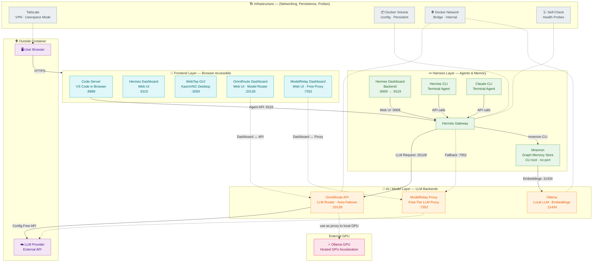

# Hermes-WebTop Architecture

Hermes-WebTop is a self-contained Docker container that gives you a full Linux desktop with VS Code, an AI coding agent (Hermes), and multiple LLM backends — all accessible from your browser. It's a turnkey environment for AI-assisted development with "computer use" capabilities.

All URI are explicitly configured not password protected. This is by design as author expects the container to be run behind a reverse proxy like Pomerium ( or github auth via codespace) and/or use Tailscale for secure access.

## Architecture Diagram



## Components

### 🖥️ Browser
**What it does:** Your web browser is the entry point — everything runs in browser

**Role in stack:** The only client-side software you need. No installation, no local tools.

### 🎨 WebTop GUI — Port 3000
**What it does:** Provides a full Ubuntu MATE desktop environment inside your browser using KasmVNC.

**Port:** `:3000` — started by the base `lscr.io/linuxserver/webtop` image.

**How it starts:** Docker `ENTRYPOINT` from the base image. Always running while the container is up.

**Role in stack:** Lets you use Linux GUI apps, run non-headless browser testing, and useful for visually monitor agents on "computer use" interaction.

### 📝 Code-Server — Port 8888
**What it does:** Runs VS Code in your browser with three AI extensions pre-installed (Hermes Code Agent, Cline, Claude Code). Access to Terminal based TUI cli via VS Code's web-based terminal interface. eg: CLI: `hermes` and `claude`

**Port:** `:8888` — started by `/docker/start-codeserver.sh` at boot.

**How it starts:** The init script installs the `code-server` binary and extensions, then launches it with `--auth none --bind-addr 0.0.0.0:8888`.

**Role in stack:** Your primary development environment — where you write code and interact with Hermes through its VS Code extension or the integrated terminal.

### 📊 Hermes Dashboard — Port :9119 (Frontend/Web UI)
**What it does:** A web UI for monitoring Hermes configuration, sessions, conversations, and agent activity — accessible directly from your browser.

**Port:** `:9119` — the same port as the Hermes Gateway, served via socat forward from internal port `:9009` so that password setup Hermes Dashboard is not needed.

**How it starts:** Started together with the Hermes Gateway by `/docker/start-hermes.sh`.

**Role in stack:** Provides visibility into what Hermes is doing — active sessions, kanban access, tool calls, and conversation history — without needing the terminal.

### ⚡ Hermes Agent — (Gateway/CLI/VSCode Extension)
**What it does:** The AI coding agent that processes your prompts, calls LLMs, and orchestrates complex multi-step tasks with sub-agents and tools.

**How it starts:** `/docker/start-hermes.sh` installs Hermes, configures providers (OmniRoute as default, ModelRelay as fallback), enables mnemon memory, then launches the Gateway in background.

**Role in stack:** The brain of the system — it receives your messages, delegates sub-agents, calls LLMs through OmniRoute/ModelRelay, stores memories via Mnemon, and returns responses. On first boot it auto-configures: model=auto-fastest, approvals off, max_turns=120, kanban failure_limit=3, mnemon as memory provider. Every boot ensures python-telegram-bot is installed and clones/updates hermes-plugin-mnemon.

### 🔧 Hermes CLI
**What it does:** The command-line interface to Hermes, accessible from any terminal inside the container (VS Code terminal, WebTop terminal).

**How it starts:** Available once Hermes is installed. No separate port — uses the Gateway API or runs directly.

**Role in stack:** The alternative interaction mode — type `hermes` commands directly in any terminal.

### 🤖 Claude CLI
**What it does:** A separate AI coding assistant from Anthropic, accessible from the VS Code terminal alongside Hermes CLI. Provides an alternative agent experience with Claude models directly.

**How it starts:** Installed via code-server extension setup. Available as `claude` command in any terminal.

**Role in stack:** Complements Hermes — use Claude CLI for tasks better suited to Claude's specific strengths, while Hermes handles multi-tool orchestration. Both share Mnemon memory. Can use Claude to fix hermes configuration issues since they are install in the same virtual machine.

### 🧠 Mnemon — Graph Memory Store
**What it does:** A persistent memory system that stores facts, preferences, and project knowledge as a graph, using Ollama embeddings for semantic search.

**How it starts:** CLI binary (v0.1.14). No server — runs as one-shot commands from Hermes and Claude Code.

**Role in stack:** Gives Hermes long-term memory across sessions (especially augemented with LLM-wiki) so it remembers your project context, past decisions, and preferences. Also integrated into Claude Code via `mnemon setup --yes --global --target claude-code`, so both Hermes and Claude Code inside VS Code share the same memory graph.

### 🌐 OmniRoute Dashboard — Port :20128 (Frontend/Web UI)
**What it does:** The web-based management UI for OmniRoute. Provides a model router dashboard where you can monitor active routes, configure model providers, and view request logs.

**Port:** `:20128` — served alongside the OmniRoute API on the same port.

**How it starts:** Started automatically by `/docker/start-omniroute.sh` at boot alongside the API.

**Role in stack:** Delegate the model switching via omniroute instead of using Hermes's configuration. Enabled browser interface to see which models are available, manage routing configuration, and monitor LLM request activity.

### 🚦 OmniRoute API — Port :20128 (AI Layer)
**What it does:** An intelligent multi-provider LLM router with auto-failover — chooses the best model for each request and falls back if one fails.

**Port:** `:20128` — started by `/docker/start-omniroute.sh` at boot.

**How it starts:** Globally installed via npm, launched as `omniroute serve --no-open --log`. On first boot, creates the `auto-fastest` combo with models `oc/deepseek-v4-flash-free` and `oc/big-pickle`. Redis is disabled (REDIS_URL=''). Login requirement is disabled on first boot. OmniRoute's database lives at `/config/.omniroute/storage.sqlite`. MCP (Model Context Protocol) is enabled and registered with Hermes.

**Role in stack:** The default LLM provider for Hermes. Routes requests to available models, handles failures, and provides MCP integration.

### 📊 ModelRelay Dashboard — Port :7352 (Frontend/Web UI)
**What it does:** Similar to Omniroute, enable free models out of box withoutn configuration.

**Port:** `:7352` — served alongside the ModelRelay proxy on the same port.

**How it starts:** Started automatically by `/docker/start-modelrelay.sh` at boot alongside the proxy.

**Role in stack:** Provides visibility into free-tier proxy operations — useful for monitoring fallback requests and troubleshooting connectivity.

### 🔄 ModelRelay Proxy — Port :7352 (AI Layer)
**What it does:** A free-tier LLM API proxy that acts as a fallback when OmniRoute cannot fulfill a request.

**Port:** `:7352` — started by `/docker/start-modelrelay.sh` at boot.

**How it starts:** Installed from the custom fork github:gitricko/modelrelay (not the public npm package), launched in an auto-restart loop. Pre-configured as the fallback provider in Hermes config.

**Role in stack:** Safety net — if OmniRoute goes down or can't find a model, ModelRelay handles the request with its free-tier models.

### 🤖 Ollama — Port 11434 (internal only)
**What it does:** A local LLM server that runs `nomic-embed-text` for generating text embeddings used by Mnemon.

**Port:** `:11434` — started by `/docker/start-ollama.sh` at boot (not exposed outside the container).

**How it starts:** Binary copied from the official Ollama Docker image, launched as `ollama serve` under user `abc`. Pulls `nomic-embed-text` after a 60-second startup delay.

**Role in stack:** Powers Mnemon's semantic memory search by converting text into embeddings. Keeps memory operations fast and local.

### ⚡ Ollama GPU — External / Hosted GPU
**What it does:** A remote Ollama instance running on a machine with a GPU, providing faster inference for local LLM tasks.

**Port:** Uses OmniRoute/ModelRelay as proxy — no direct port.

**How it connects:** Configured as a model provider in OmniRoute via the 'Config Free API' path. When the local CPU-based Ollama (:11434) is too slow, this external GPU-powered instance handles the heavy lifting.

**Role in stack:** Accelerates local LLM workloads by offloading to GPU hardware without running GPU drivers inside the container.

### 🔒 Tailscale
**What it does:** A zero-config VPN that lets you access the container securely from anywhere.

**How it starts:** `/docker/start-tailscale.sh` at boot. Runs in userspace mode with statedir at `/config/.tailscale`.

**Role in stack:** Provides secure remote access. Not auto-logged-in — you run `sudo tailscale up` manually when needed.

### 🩺 Self-Check — Diagnostics Tool at /usr/local/bin/self-check

**What it does:** A boot-time health diagnostic that polls all 5 service ports (WebTop :3000, CodeServer :8888, ModelRelay :7352, OmniRoute :20128, Hermes Gateway :9119), checks OmniRoute model availability, Mnemon binary + database, Hermes config validity, disk usage, memory pressure, and cron job status. Optionally delivers a Telegram health report.

**How it starts:** Runs automatically at the end of start-hermes.sh after all services are ready. Can be re-run manually anytime: `/usr/local/bin/self-check`.

**Role in stack:** Gives you instant visibility into whether the container is healthy — especially useful after a restart or before debugging.

### 💾 Docker Volume — /config
**What it does:** A named Docker volume mounted at `/config` that persists all data: Hermes config, OmniRoute database, VS Code extensions, mnemon data, Tailscale state, and user files.

**Role in stack:** The single source of truth for persistent state — survive container restarts and re-creates.

### 🌐 Docker Network — hermes-webtop-net
**What it does:** A bridge network that connects all services internally so they can communicate by container name.

**Role in stack:** Enables services to find each other (Hermes → OmniRoute at `localhost:20128`, etc.) without exposing everything to the outside world.

## Boot Sequence — How Everything Starts

The container base image (LinuxServer.io WebTop) automatically runs every .sh script in /custom-cont-init.d/ on boot. This is how all services start without manual intervention. The init scripts run in this general order:

1. common.sh — Helper functions for other scripts
2. start-ohmyzsh.sh — Shell customization
3. start-ollama.sh — Ollama local LLM (embeddings daemon)
4. start-omniroute.sh — OmniRoute LLM router
5. start-modelrelay.sh — ModelRelay free-tier proxy
6. start-codeserver.sh — VS Code in browser + extensions
7. start-hermes.sh — Hermes Agent, Gateway, Dashboard, Mnemon plugin, self-check, Telegram deps
8. start-tailscale.sh — Tailscale VPN (must log in manually)

All init scripts are in the docker/ directory of the repository.

## Data Flow: When You Type a Message to Hermes

Here's the full journey of a message from your keyboard to the LLM and back:

```
1. 🖥️ You type in VS Code (port :8888) or the Claude CLI terminal
       │
       ▼
2. 📝 VS Code extension (Hermes Code Agent / Cline / Claude Code)
   or Claude CLI sends your message via HTTP to...
       │
       ▼
3. ⚡ Hermes Gateway (port :9119)
       │  processes the message
       │  checks mnemon for relevant memories
       │  (memory recall — checks Mnemon for relevant context)
       ▼
4. 🧠 Hermes calls OmniRoute API (port :20128)
       │  for LLM completion
       │
       ├─ ✅ OmniRoute finds a model → sends request → gets response
       │
       ├─ 🔀 OmniRoute falls back via "Config Free API" → external LLM Provider
       │
       ├─ 🔀 OmniRoute proxies to Ollama GPU for accelerated inference
       │
       └─ ❌ OmniRoute fails → Hermes Gateway falls back to ModelRelay (port :7352)
                               sends request → gets response
       │
       ▼
5. 🧠 Mnemon may query Ollama (port :11434) for embeddings
       │  to store/retrieve memories
       │  (memory storage — saves new facts to Mnemon)
       ▼
6. 🔄 Response flows back through the chain:
       LLM → OmniRoute/ModelRelay → Hermes Gateway → Code-Server/CLI → Browser
```

**In more detail:**

1. **Browser → Code-Server (:8888) / Claude CLI terminal:** You open VS Code in your browser and type a prompt in the Hermes extension or terminal, or you run `claude` commands directly in the terminal.
2. **Code-Server / Claude CLI → Hermes Gateway (:9119):** The extension or CLI sends your message to the Hermes Gateway API.
3. **Hermes processes:** Hermes expands your prompt with system instructions, checks Mnemon for relevant context from past sessions, and may spawn sub-agents for parallel subtasks.
4. **Hermes → OmniRoute API (:20128):** For the LLM call, Hermes sends a request to OmniRoute, which selects the best available model from its `auto-fastest` combo. OmniRoute may route via the "Config Free API" path to external LLM providers, or proxy to an external Ollama GPU for accelerated inference. If OmniRoute fails entirely, Hermes Gateway automatically falls back to ModelRelay Proxy (:7352).
5. **Memory operations:** Hermes may store new information via Mnemon, which uses Ollama (:11434) to generate embeddings for semantic indexing.
6. **Response:** The LLM's response travels back through the same path — OmniRoute/ModelRelay → Hermes Gateway → Code-Server/CLI → your browser. Hermes also updates Mnemon with key facts from the conversation.

## Port Map

| Port | Service | What It Does | Exposed? |
|------|---------|-------------|----------|
| 3000 | **WebTop GUI** | Full Linux desktop (Ubuntu MATE) in browser via KasmVNC | ✅ Yes |
| 8888 | **Code-Server** | VS Code in browser with AI extensions | ✅ Yes |
| 9119 | **Hermes Gateway + Dashboard (Frontend)** | Agent HTTP API and web UI (socat forward from :9009) | ✅ Yes |
| 8642 | **Hermes API** | Optional dedicated API server | ✅ Yes (optional) |
| 20128 | **OmniRoute Dashboard** | Web UI for model router management | ✅ Yes |
| 20128 | **OmniRoute API** | Multi-provider LLM router with auto-failover | ✅ Yes |
| 7352 | **ModelRelay Dashboard** | Web UI for free-tier proxy monitoring | ✅ Yes |
| 7352 | **ModelRelay Proxy** | Free-tier LLM API proxy | ✅ Yes |
| 9009 | **Hermes Dashboard (Harness)** | Web dashboard (internal — forwarded to :9119) | ❌ Internal |
| 11434 | **Ollama** | Local LLM server for embeddings | ❌ Internal |
| N/A | **Hermes CLI** | Terminal-based agent interface | ❌ Terminal only |
| N/A | **Claude CLI** | Terminal-based AI assistant from Anthropic | ❌ Terminal only |
| N/A | **Mnemon** | Graph memory store CLI tool | ❌ CLI tool only |
